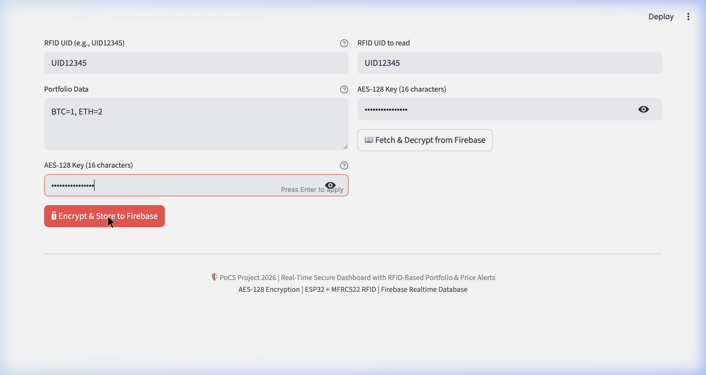
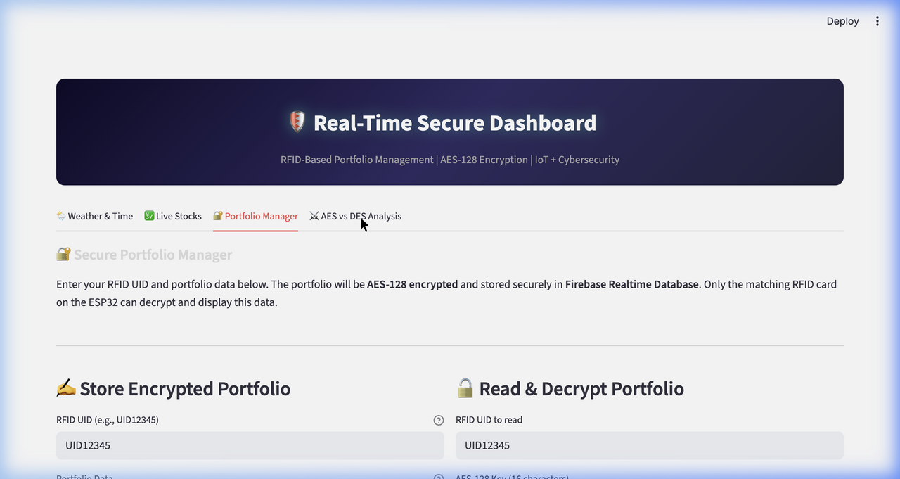
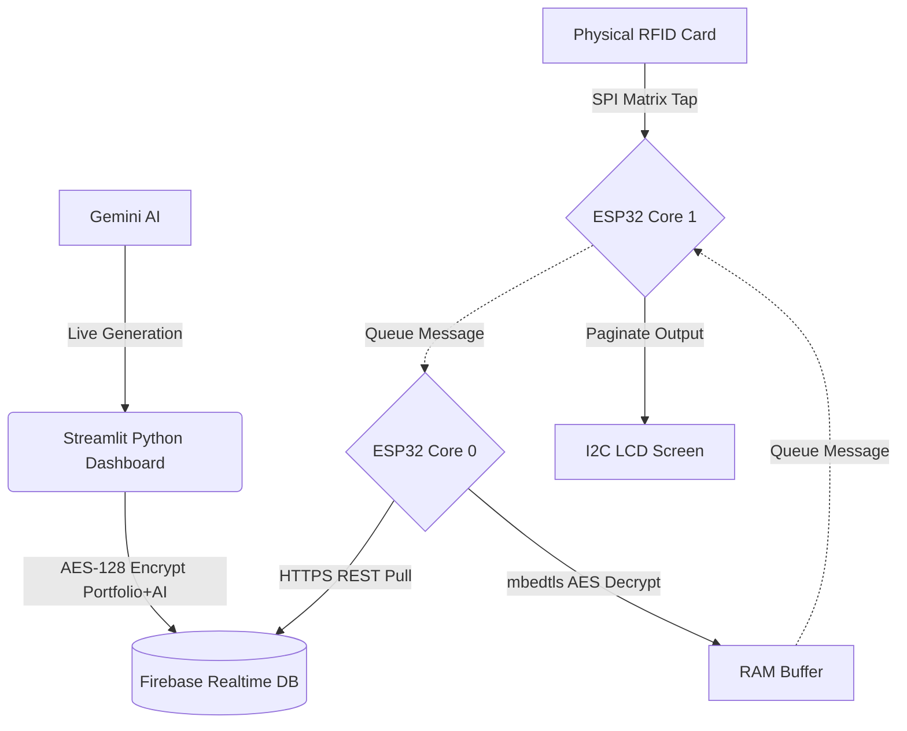

# 🛡️ PoCS Final Project: Edge-AI Secure Hardware Wallet & Dashboard

A comprehensive **Microprocessors & Edge-AI Cybersecurity Project** integrating an ESP32 hardware module, MFRC522 RFID authentication, native AES-128 encryption, FreeRTOS Symmetric Multiprocessing, and Cloud Generative AI.


---

## 🌟 Key Functional Features

### 1. 🧠 FreeRTOS Dual-Core Processing
Unlike standard embedded projects, this ESP32 firmware natively schedules execution across **both cores**:
- **Core 0 (NetworkTask):** Asynchronous Wi-Fi handling, Firebase payload decryption using `mbedtls`, and continuous web-polling.
- **Core 1 (HardwareTask):** Hardware I/O processing including the 16x2 I2C LCD pagination algorithms, buzzer PWM rendering, and RFID (SPI) matrix decoding.

### 2. 🛡️ Anti-Brute Force Hardware Lockdown
The firmware features an advanced anomaly-detection state machine.
If the RFID scanner detects highly rapid polling (e.g., 3 physical taps in under 5 seconds), the ESP32 internally detects an edge attack. It overrides the database query loop, securely scrubs its RAM buffers, and triggers a visual/audial lockdown siren pattern.

### 3. 🤖 Edge-to-Cloud Generative AI (Gemini)
The Python Web Dashboard actively processes your financial portfolio through **Gemini 2.5 Flash**. 
The AI evaluates your holdings and provides actionable market strategies (e.g., `"HOLD Mkt Volatile"`). This string is mathematically combined with your portfolio, AES-128 encrypted, and synced to Firebase. 

When you authenticate physically via RFID, the ESP32 natively pulls the AES blob and directly pages the Generative AI text onto the hardware LCD screen.



### 4. 📈 Cryptography Telemetry (AES vs DES vs Hashes)
The security analysis suite provides live web visualizations of:
- **AES vs DES Performance Evaluation**
- **ECB vs CBC Leakage Demonstration**
- **The Hash Avalanche Effect (SHA-256 vs MD5)**



---

## ⚙️ Architecture & Wiring

### Hardware Connections (ESP32 DOIT DevKit V1)
| Component | ESP32 Pin | Note |
| --- | --- | --- |
| **MFRC522 RFID** | D5, D23, D19, D18, D4 | Standard SPI Bus + Reset |
| **16x2 I2C LCD** | D21, D22 | I2C Bus (SDA/SCL) |
| **LED** | D12 | Hardware Status |
| **Buzzer** | D13 | PWM Telemetry |

### The Data Flow


---

## 🚀 How to Run the Project

### 1. Hardware Initialization
1. Flash the code in `esp32_firmware/esp32_firmware.ino` to the ESP32 using the Arduino IDE.
2. The ESP32 will boot and connect to the Hotspot provided in the firmware configuration.

### 2. Python Environment Setup
Install the rigid dependencies securely:
```bash
pip install -r requirements.txt
```

### 3. Environment Variables
Create a file locally named `.env` in the exact structure as `.env.example`.
```env
WEATHER_API_KEY=your_openweathermap_key
GEMINI_API_KEY=your_google_ai_studio_key
```
*(Note: Do not commit the `.env` file!)*

### 4. System Launch
Launch the core dashboard:
```bash
streamlit run main_dashboard.py
```
In a secondary terminal, launch the background AI poller:
```bash
python ai_background_worker.py
```
